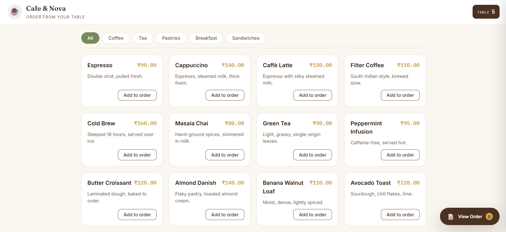
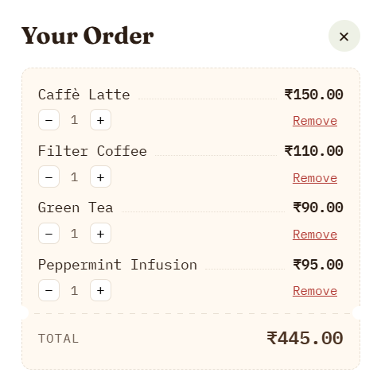

# ☕ Café Nova — QR Ordering System

Café Nova is a full-stack restaurant ordering system designed to simplify table-based food ordering.

Customers can scan a QR code at their table, browse the digital menu, add items to a cart, provide their details and special instructions, and place an order.

The order is sent to a Flask REST API, stored in PostgreSQL, and displayed on a separate kitchen dashboard where staff can manage the order status.

---

## 🌐 Live Demo

### Customer Website

https://cafe-nova-qr-ordering-system.vercel.app/

### Kitchen Dashboard

https://cafenova-kitchen.vercel.app/

### Backend API

https://cafenova-backend.onrender.com/

---

## 🚀 Features

### Customer Ordering

- QR-based table ordering
- Digital food and beverage menu
- Add and remove items from cart
- Item quantity management
- Customer name and phone number
- Table number identification
- Special instructions
- Automatic order total calculation
- Order confirmation

### Kitchen Dashboard

- View incoming orders
- View customer and table information
- View ordered items and quantities
- View special instructions
- View order totals
- Track order status
- Pending → Preparing → Ready → Completed
- Dashboard order statistics
- Manual order refresh
- Online/offline API connection indicator

---

## 📸 Screenshots

### Customer Menu



### Customer Details


### Order Confirmation


### Kitchen Dashboard


### Orders



### Order Status Management


---

## 🔄 How It Works

```text
Customer
   │
   │ Scan Table QR
   ▼
Café Nova Website
   │
   │ POST /api/orders
   ▼
Flask REST API
   │
   ▼
PostgreSQL
   │
   │ GET /api/orders
   ▼
Kitchen Dashboard
   │
   │ PATCH /api/orders/<id>
   ▼
Order Status Updated
```

---

## 🛠️ Technology Stack

### Frontend

- HTML5
- CSS3
- JavaScript

### Backend

- Python
- Flask
- Flask-CORS
- Psycopg
- Gunicorn

### Database

- PostgreSQL for production
- SQLite fallback for local development

### Deployment

- Vercel — Customer Website
- Vercel — Kitchen Dashboard
- Render — Backend API
- Render PostgreSQL — Production Database
- GitHub — Source Code and Version Control

---

## 📂 Project Structure

```text
CafeNova/
│
├── Backend/
│   ├── app.py
│   └── requirements.txt
│
├── frontend/
│   ├── admin/
│   │   ├── index.html
│   │   ├── admin.css
│   │   └── admin.js
│   │
│   ├── css/
│   ├── js/
│   └── index.html
│
├── assets/
│   └── screenshots/
│       ├── Customer details.png
│       ├── Kitchen Dashboard.png
│       ├── Menu.png
│       ├── Order Confirmation.png
│       ├── Order status.png
│       └── Orders.png
│
├── .gitignore
├── LICENSE
└── README.md
```

---

## 🔌 API Endpoints

### Create Order

```http
POST /api/orders
```

Creates a new customer order.

### Get Orders

```http
GET /api/orders
```

Returns orders for the kitchen dashboard.

### Update Order Status

```http
PATCH /api/orders/<order_id>
```

Updates the status of an existing order.

Supported statuses:

```text
pending
preparing
ready
completed
```

---

## 🗄️ Database

Production uses PostgreSQL.

The backend reads the PostgreSQL connection string from the `DATABASE_URL` environment variable.

For local development, the application falls back to SQLite when `DATABASE_URL` is not configured.

---

## 💻 Local Development

### 1. Clone the repository

```bash
git clone https://github.com/vhemmu/CafeNova-QR-Ordering-System.git
cd CafeNova-QR-Ordering-System
```

### 2. Install backend dependencies

```bash
cd Backend
pip install -r requirements.txt
```

### 3. Start the Flask backend

```bash
python app.py
```

### 4. Run the frontend locally

From the project root:

```bash
python -m http.server 5500
```

Then open:

```text
http://127.0.0.1:5500/frontend/
```

---

## 📌 Project Status

**Live and functional**

The current version includes:

- Customer ordering interface
- QR-based table ordering
- Flask REST API
- PostgreSQL production database
- Kitchen dashboard
- Order status management
- Vercel deployment
- Render deployment
- Local SQLite fallback

This project was built as a full-stack portfolio project to demonstrate frontend development, REST API development, database integration, Git/GitHub workflow, and cloud deployment.

---

## 👨‍💻 Author

**Hemant Verma**

GitHub:  
https://github.com/vhemmu

---

## 📄 License

This project is licensed under the MIT License.
